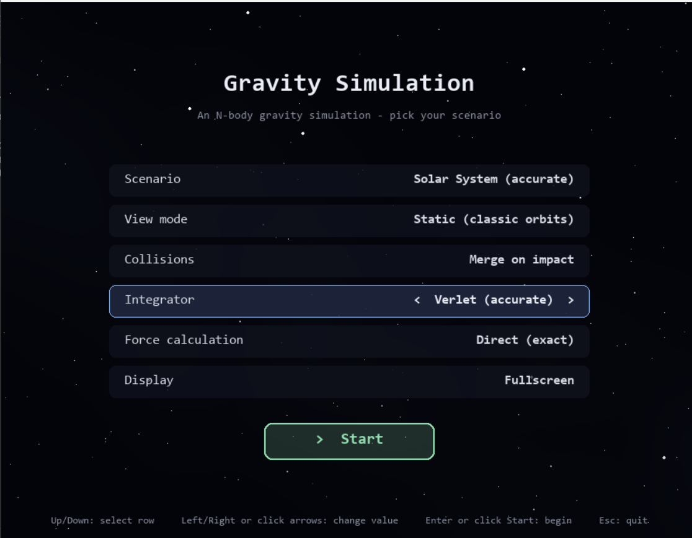
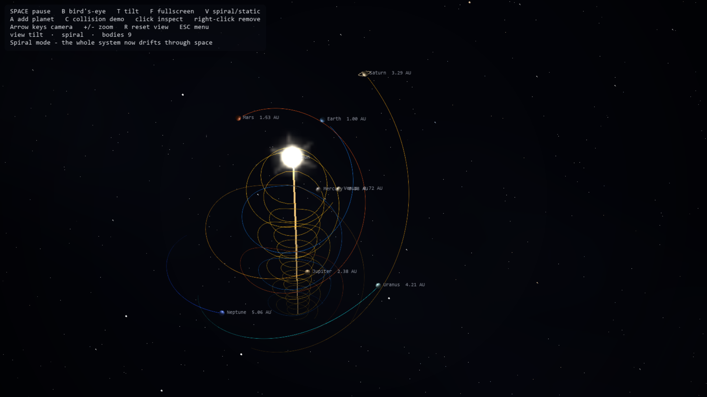

# 🌌 OOP Gravity Simulation 🌌

> A Python-based 3D N-body gravity simulation application with an interactive graphical menu, real-time orbit rendering, and customizable physics environments.

---

## 📌 About the Project

**OOP Gravity Simulation** is a Python application that simulates gravitational interactions between celestial bodies under Newtonian physics (`F = G * m1 * m2 / r^2`). 

Users can select pre-built space scenarios, tweak physical constants, toggle numerical integrators, enable Barnes-Hut algorithm performance optimizations, and inspect planetary movement in real-time or export states to JSON files.

---

## ✨ Features

* **Real N-Body Physics Engine:** Every celestial body exerts gravitational pull on all other bodies.
* **Multiple Built-in Scenarios:** Solar System, Randomized Star Clusters, Three-Body problem, and Gravity-Assist trajectories.
* **Dual Execution Modes:** Interactive Pygame GUI menu mode and automated terminal CLI mode.
* **Barnes-Hut Octree Optimization:** Reduces gravitational force calculation complexity from O(N²) to O(N log N) for high body counts.
* **Polymorphic Numerical Integrators:** Choose between Verlet (energy-conserving) and Euler integration algorithms.
* **Interactive Controls:** Zoom, pan, tilt camera, spawn collisions, and inspect body attributes dynamically.
* **State Persistence:** Save and load full simulation states to and from JSON files.

---

## 🖼️ Application Preview

### Scenario Selection & Setup Screen
Select a simulation scenario, configure integrator settings, and customize body properties before launching.



### Live 3D Gravity Simulation
Real-time rendering of orbits, velocity vectors, and gravity wells.



---

## 🛠️ Technologies Used

| Technology | Purpose |
| :--- | :--- |
| **Python 3.10+** | Core programming language |
| **Pygame / Pygame-CE** | Interactive GUI menu, rendering, and input loop |
| **NumPy / Vector3D** | High-performance 3D spatial calculations and linear algebra |
| **JSON** | Simulation state persistence and configuration import/export |

---

## 🧠 OOP Four Core Concepts

Our project strictly demonstrates the four fundamental pillars of Object-Oriented Programming:

| Concept | Description | Project Implementation |
| :--- | :--- | :--- |
| **Encapsulation** | Bundling data and methods together while enforcing data validation. | Mass and radius properties in `CelestialBody` feature strict validation preventing non-positive values. |
| **Abstraction** | Hiding complex implementation details behind clean interfaces. | `CelestialBody` and `Integrator` serve as abstract base classes defining contract methods for concrete implementations. |
| **Inheritance** | Reusing and extending attributes and methods across class hierarchies. | `Planet` and `Star` inherit shared physics traits from `CelestialBody` while defining custom visual attributes. |
| **Polymorphism** | Executing specialized behaviors based on object context. | `Simulation` invokes `integrator.step(...)` seamlessly regardless of whether `VerletIntegrator` or `EulerIntegrator` is active. |

---
## ✨Requirements

- Python 3.10+
- `pygame`
- `numpy`

## ✨Installation

```bash
pip install -r requirements.txt
```
## 🎗️ Usage

**Menu mode** (recommended to start) — just run it with no arguments:

```bash
python main.py
```

This opens a settings screen where you can pick the scenario, view mode,
integrator, collision behavior, and force-calculation method before launching.

**Command-line mode** — for scripting, testing, or launching straight into a
specific configuration:

```bash
python main.py --scenario solar --integrator verlet
python main.py --scenario cluster --bodies 300 --barnes-hut
python main.py --scenario three_body --spiral
python main.py --scenario solar --save my_scene.json
python main.py --load my_scene.json
python main.py --compare-integrators --scenario three_body
```
## ⚙️Controls

| Input | Action |
|---|---|
| Left-click a body | Inspect it (name, mass, speed, orbital period) |
| Right-click a body | Remove it |
| `A` | Add a new ringed planet at a random position, on a circular orbit |
| `C` | Spawn two bodies on a guaranteed collision course |
| `V` | Toggle between static and spiral view modes |
| `B` / `T` | Bird's-eye view / tilted "spacetime fabric" view |
| Arrow keys (hold) | Up/down: camera pitch. Left/right: orbit (yaw) around the scene |
| `+` / `-` (hold), or mouse wheel | Zoom in / out |
| `R` | Reset zoom/pitch/yaw to the default view |
| `F` | Toggle fullscreen |
| Spacebar | Pause / resume |
| Esc | Back to the menu (close the window to quit) |

## 📁 Project Structure

```text
Gravity-Simulation/
│
├── main.py
├── menu.py
├── requirements.txt
├── .gitignore
│
├── physics/
│   ├── __init__.py
│   ├── body.py
│   ├── constants.py
│   ├── integrator.py
│   └── vector.py
│
├── simulation/
│   ├── __init__.py
│   ├── simulation.py
│   └── octree.py
│
├── rendering/
│   ├── __init__.py
│   ├── visualizer.py
│   ├── ui_overlay.py
│   ├── interaction.py
│   └── body_effects.py
│
└── scene/
    ├── __init__.py
    ├── camera.py
    ├── sphere_render.py
    ├── spacetime_grid.py
    └── starfield.py

```
## 👥 Group Project Team
Developed collaboratively by our project team.

| Name | GitHub Handle |
| :--- | :--- |
| member 1  | @nilmika |
| member 2  | @tamadiperera |
| member 3  | @nilarafernando |
| member 4  | @dinukasanju02 |

---
🚀 Built with python & pygame.


